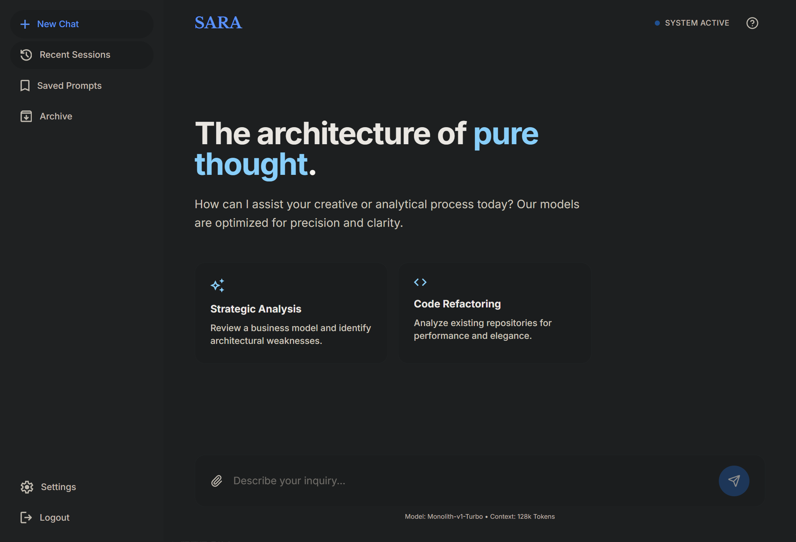

[English](README.md)
# SaRa - Super agent with rag

一个基于Flask + LLM的智能文档问答系统，支持DOCX文档上传、智能索引和基于检索增强生成(RAG)的问答。


## 快速开始

### 环境要求

- Python 3.11+
- uv (依赖管理工具)

### 安装依赖

```bash
cd api
uv sync
```

### 运行Web服务

```bash
cd api
uv run python app.py
```

服务将运行在 `http://localhost:5001`

## CLI工具使用指南

> 前提：已在 `api/` 目录下完成安装。
> ```bash
> cd api && uv pip install --python .venv/bin/python -e .
> ```
> 之后可直接使用 `sara` 命令（需激活 `.venv`），或通过 `.venv/bin/sara` 调用。

### 命令总览

```
sara chat        交互式LLM聊天
sara chat_once   单次LLM问答
sara upload      上传并索引DOCX文件
sara query       交互式RAG问答
sara ask         单次RAG问答
```


---

## RAG工作流程

### 1. 文档上传与索引

```
用户上传DOCX → FileService验证 → LocalStorage保存
                                      ↓
                                DoclingLoader加载
                                      ↓
                          FileIndexer处理 (LLM)
                          ├─ 生成description (摘要)
                          └─ 重组content (结构化)
                                      ↓
                          保存markdown索引文件
```

**索引文件格式** (`storage/index_files/{file_uuid}.md`):
```markdown
---
description: LLM生成的文档摘要 (100-200字)
source_file: doc1.docx
---

# Content

LLM重新组织的结构化内容，保留段落层级关系
```

### 2. 智能检索与问答

```
用户提问 → Retriever两阶段检索
            ├─ 阶段1: 扫描所有markdown的description
            ├─ 阶段2: LLM对description评分 (0-1)
            ├─ 阶段3: 筛选高于阈值(0.6)的文档
            └─ 阶段4: 加载完整content
                        ↓
                    构建上下文
                        ↓
                    ChatService生成答案
                        ↓
                    返回答案+来源
```

**检索策略优势**:
- **高效**: 先用轻量级description快速筛选，避免加载所有文档
- **精准**: LLM评分确保语义相关性
- **可解释**: 返回相关性评分和来源文档

---

## 配置说明

### 环境变量 (`.env`)

```bash
# LLM配置
LLM_API_KEY=your-api-key
LLM_API_BASE=https://api.openai.com/v1
LLM_DEFAULT_MODEL=gpt-4
LLM_MAX_TOKENS=4096
LLM_TEMPERATURE=0.7

# 文件配置
FILE_SIZE_LIMIT=50
FILE_EXTENSIONS=txt,docx,pdf

# 存储配置
STORAGE_TYPE=local
LOCAL_STORAGE_PATH=./storage
```

### 支持的文件格式

当前版本支持:
- ✅ `.docx` (Microsoft Word文档)

计划支持:
- 🔄 `.pdf` (PDF文档)
- 🔄 `.txt` (纯文本)

---

## 核心技术

- **Web框架**: Flask + Flask-RESTX
- **异步处理**: asyncio + async/await
- **LLM集成**: LiteLLM (支持多种模型)
- **文档解析**: Docling (IBM开源)
- **CLI框架**: Typer + Rich (精美终端UI)
- **数据验证**: Pydantic
- **测试框架**: Pytest
- **依赖管理**: uv

---

## 开发指南

### 代码规范

- 使用 `ruff` 进行代码检查和格式化
- 所有函数必须有类型注解
- 控制器层薄化，业务逻辑在服务层
- 遵循Clean Architecture原则

### 运行代码检查

```bash
cd api

# 检查代码
uv run ruff check .

# 自动修复
uv run ruff check --fix .

# 格式化代码
uv run ruff format .
```

### 数据库迁移

```bash
cd api

# 生成迁移
uv run flask db migrate -m "描述"

# 应用迁移
uv run flask db upgrade
```

---

## 项目特性

### ✨ 核心特性

1. **智能文档索引**
   - LLM自动生成文档摘要
   - 保留原文结构和层级关系
   - 支持增量索引

2. **两阶段检索**
   - 快速描述筛选 + 完整内容加载
   - LLM语义相关性评分
   - 可配置相关性阈值

3. **多种交互方式**
   - CLI交互式会话
   - CLI单次查询
   - REST API接口

4. **精美终端UI**
   - Rich库驱动的表格、面板、Markdown渲染
   - 实时进度显示
   - 彩色输出和图标

### 🔒 安全特性

- 文件类型验证
- 文件大小限制
- 文件名非法字符检查
- 存储路径隔离

---

## 许可证

MIT License

---

## 贡献

欢迎提交Issue和Pull Request！

---

## 联系方式

如有问题或建议，请提交Issue。
